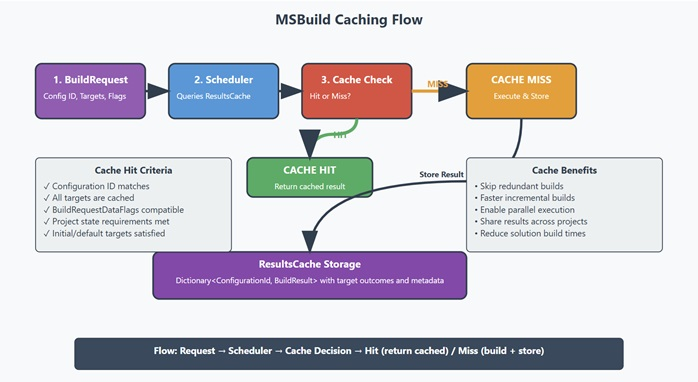

# MSBuild Caching: `ResultsCache`

MSBuild uses caching to speed up builds. It does this by remembering the outcomes of parts of the build it has already completed. If it needs to build the same part again with the same settings, it can often reuse the stored outcome instead of doing all the work from scratch. This is especially helpful for large projects or when you're making small changes and rebuilding.

## `ResultsCache` (The Core Cache Component)

`ResultsCache` is the primary storage mechanism where MSBuild keeps the outcomes of its build targets.

### What It Does

1.  **Stores and Retrieves Build Outcomes**:
    *   It holds onto `BuildResult` objects. Each `BuildResult` is a record of the outcome for one or more build steps (targets) for a specific project setup (configuration).
    *   These outcomes are organized using a special ID (`configurationId`) that represents the unique way a project was defined (like list of targets, tools versions, etc).
    *   When MSBuild is about to build something, it first queries this cache: "Have I processed this exact task before with these exact settings?" If the cache has a valid outcome, MSBuild can use it.
    *   When new build work is completed, the outcomes are added to this cache so they can be used in the future. If outcomes for that specific setup already exist, the new information is merged with the old.

2.  **Checks if a Build Request Can Be Fulfilled from Cache**:
    *   Before actually starting a build task, MSBuild uses this cache to see if all the necessary pieces have already been successfully built and their stored outcomes are still valid.
    *   This check considers the specific build settings and whether detailed project information (like all its properties and items) is needed from the cached outcome. If everything checks out, the build step can be satisfied from the cache.

3.  **Clears Out Stored Outcomes**:
    *   Sometimes, the cache needs to be cleared. `ResultsCache` can remove all the outcomes it has stored.
    *   It can also clear out outcomes for just one specific project setup, for example, if project files have changed and the old outcomes are no longer valid.

4.  **Prepares Cache Data for Transfer**:
    *   `ResultsCache` can convert the information it stores (either all of it or specific `BuildResult` records) into a special format.
    *   This format can then be sent to other MSBuild processes.

### How `BuildRequestDataFlags` Affect Caching

When MSBuild decides to build something, the request (`BuildRequest`) carries special instructions called `BuildRequestDataFlags`. These flags tell MSBuild *how* to perform the build and *what kind of result* is expected. The `ResultsCache` pays close attention to these flags because they are crucial for determining if a cached outcome is truly a match for a new request.
It's an out-in feature that can be disabled with change wave `17.12`. See more details in [ChangeWaves.md](ChangeWaves.md)

Here's how some important flags interact with caching:

*   **Flags Affecting Build Behavior:** - if any of the flags is presented only in request or cache - cache miss is returned:
    *   `IgnoreMissingEmptyAndInvalidImports`: This flag changes how MSBuild handles project imports. If a cached outcome was generated with a different setting for this flag than the current request, the cache will consider it a mismatch.
    *   `FailOnUnresolvedSdk`: Similar to the imports flag, this affects SDK resolution.

*   **Flags Affecting What's Returned (`ProjectInstance` State):**
    *   `ProvideProjectStateAfterBuild`: If a build request includes this flag, it means the caller wants the complete `ProjectInstance` (all evaluated properties, items, etc.) along with the target outcomes.
        *   **Cache Hit**: A cached `BuildResult` can satisfy this if it also contains the full `ProjectInstance` (meaning it was originally built with this flag).
        *   **Cache Miss**: If the cached `BuildResult` *doesn't* have the full `ProjectInstance`, it cannot satisfy a request that demands it, even if the target outcomes match.
    *   `ProvideSubsetOfStateAfterBuild`: This flag is used when the caller only needs specific parts of the `ProjectInstance`, defined by a `RequestedProjectStateFilter`.
        *   **Cache Hit**: A cached `BuildResult` can satisfy this if:
            1.  It contains the full `ProjectInstance` (the full state naturally includes any subset).
            2.  It was itself created with `ProvideSubsetOfStateAfterBuild`, and the subset it contains is a superset of (or identical to) what the current request is asking for.
        *   **Cache Miss**: If the cached subset is insufficient for the current request's filter.

When a `BuildResult` is stored in the cache, the `BuildRequestDataFlags` active during its creation are saved with it. During a cache lookup, these stored flags are compared against the flags of the new `BuildRequest` to ensure compatibility. If the flags indicate a significant difference in how the build was or should be performed, or in what output is expected, a cache miss will occur even if target names and configurations seem to match.

### How It Works with Other Parts

*   **`Scheduler`**: This is the part of MSBuild that decides what to build and when. It communicates frequently with `ResultsCache` – asking if work can be satisfied from the cache and informing the cache about new outcomes.
*   **`BuildResult`**: This is the `BuildResult` object that `ResultsCache` stores. `ResultsCache` uses features of `BuildResult` to combine outcomes and check if they are still valid.
*   **`BuildRequest`**: When MSBuild needs to build something, it creates a `BuildRequest`. This request tells `ResultsCache` what to look for (which project setup, which targets, and what kind of outcome, including flags, is needed).
